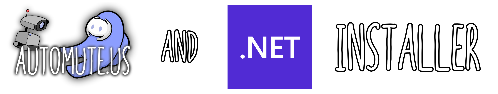

# 

CaptureInstaller is a user friendly installer for [AmongUsCapture](https://github.com/denverquane/amonguscapture) and [.NET 5 Desktop Runtime](https://dotnet.microsoft.com/download/dotnet/5.0#runtime-desktop-5.0.1) 

## Supported versions of Among Us
| Platform        | Supported? |
|-----------------|:------------:|
| Steam           |      ✔️     |
| Epic Games      |      ✔️     |
| Itch.io         |      ✔️     |
| Microsoft store |      ✔️     |

# Installation

<h4>Download the latest version of the CaptureInstaller here:
</h4>

If you don't have the AutoMuteUs discord bot, invite it here:

## Usage

Note: This will not work for Windows versions older than 10 unless you have cURL installed. [Download the capture directly instead here.](https://github.com/automuteus/amonguscapture/releases/latest)

1) Download the latest version of the CaptureInstaller above or click [here.](https://github.com/automuteus/capture-install/releases/latest/download/CaptureInstaller.bat)
2) Once you have the CaptureInstaller.bat run the file and a Windows Smart Screen message may pop up, if so click `More Info` and `Run Anyway` [example](https://media.discordapp.net/attachments/780435741650059268/798023233186168863/smartscreen.png)
3) NET 5 Desktop Runtime will start to install and you will be prompted to press `Allow` once it has been installed. Then the rest is done for you!

## License

 
